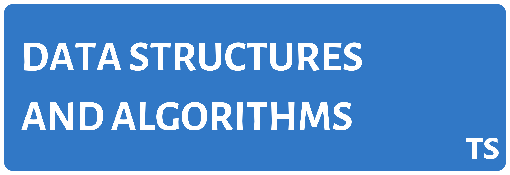

Data Structures and Algorithms implemented using Typescript.

## Outline
> ## [Data Structures](#data-structures)  
>> ### [Linea Data Structures](#linear-data-structures)
>>> #### Lists
>>>> - [x] [Singly linked list](src/data-structures/linear/lists/singly-linked-list.ts)  
>>>> - [ ] [Doubly linked list](src/data-structures/linear/lists/doubly-linked-list.ts)  
>>>> - [ ] [Circular linked list](src/data-structures/linear/lists/circular-linked-list.ts)  
>>> #### Stack 
>>>> - [ ] [Array implementation of stack](src/data-structures/linear/stack/array-implementation-of-stack.ts)  
>>>> - [ ] [Linked list implementation of stack](src/data-structures/linear/stack/linked-list-implementation-of-stack.ts)  
>>>> - [ ] [Single queue implementation of stack](src/data-structures/linear/stack/single-queue-implementation-of-stack.ts)  
>>>> - [ ] [Double queue implementation of stack](src/data-structures/linear/stack/double-queue-implementation-of-stack.ts)  
>>> #### Queue
>>>> - [ ] [Array implementation of queue](src/data-structures/linear/queue/array-implementation-of-queue.ts)  
>>>> - [ ] [Stack implementation of queue](src/data-structures/linear/queue/stack-implementation-of-queue.ts)  
>>>> - [ ] [Deque (Double ended queue)](src/data-structures/linear/queue/deque.ts)  
>>>> - [ ] [Circular queue](src/data-structures/linear/queue/circular-queue.ts)  

>> ### [Non Linea Data Structures](#non-linear-data-structures)
>>> [Trees](#linked-lists)
>>> [Graphs](#linked-lists)
>>> [Tables](#linked-lists)
>>> [Sets](#linked-lists)

> [Algorithms](#algorithms)

#### Data Structures

#### Algorithms